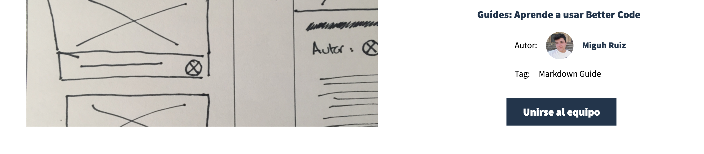
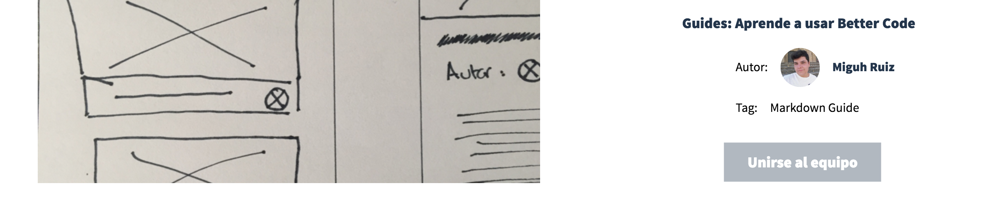

#Start collaborating in a team: Join an existing idea in the application.

If you saw a project that you fell in love with, it's decided - you have to collaborate on it. It's really simple, just go to [View Project](#) then click the button that says `Join the Team.`

After this you should recieve an email from Github notifying you that you have gained access to the repository, thanks to our [Github integration.](#).

###'I cannot join the project - I see a gray button.'

If, instead of as in the image above, you see a gray button, **a gray button means you are already in the project**. You don't have to do anything more. You can start collaborating.

###'I cannot join the project - I get an error message'

If you get an error message when you try to join (characterised by a red background), you may be experiencing a problem with the Github API. Try again later. If the problem persists it may be our error, so do not hesitate to [use one of our contact methods](#) to report the bug.
