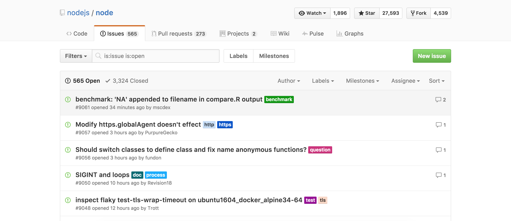

# How to collaborate on an idea: Start writing code and contributing ideas to the community.

Once you have [signed up to work on an idea](#) you can begin collaborating. All the repositories of ideas are in [our Better Code organisation](https://github.com/BetterCodeHQ) which you're also a part of [having registered with us.](#). In case you didn't know, check your email, **you should have an invitation to the BetterCodeHQ organisation**.

Look there for the repository of the idea you have added to. **It has to have the same name as in Better Code, but without the description**, (so, the name before the two points in the [detail view of the project](). You can also check your email now that you have **confirmation of access to the repository**

## What do I do once I am in the repository?

Each idea has a different organisation, although Github has some basics that I will comment on. **The majority of projects are based on those guidelines.**

* We recommend that the creators of ideas leave a `CONTRIBUTING.md`, in the repository, in which you can find guidelines on how and in what to contribute.

* Check the **issues of the repository**. It is the section in which the idea's creator should have left pending tasks. As an example, here we show you the issues of the official repository of Node.JS.

Remember that the project can be organised in many different ways, for example, using the new Github Project function (something like Trello in-app). We give the guidelines but the creators choose what to do or not do with their space. Contact them to start collaborating if you find something too confusing. If you keep experiencing problems, do not hesitate to [contact us](#).

