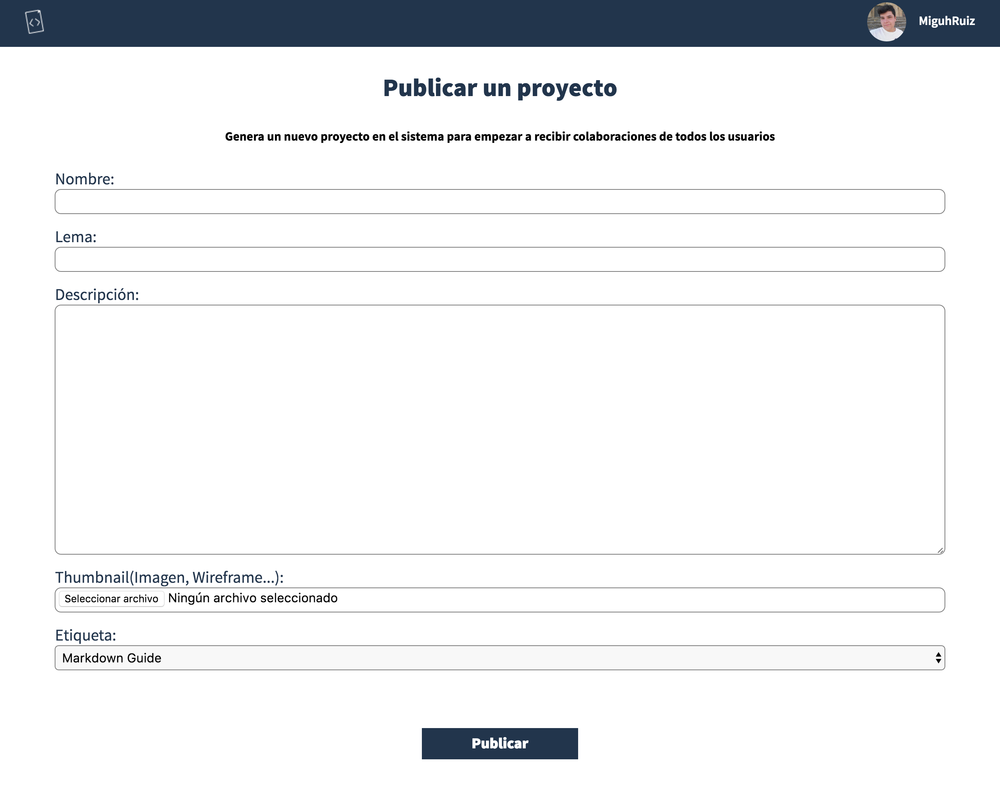

# Create an idea: The machine moves Better Code

We are pleased to see that you have decided to create an idea in Better Code :smile:, thank you the community will grow gradually.

In this guide we will take you step by step through the process of creating an idea and you're doing in each action:

## Fill in the form to create an idea

To access the form that lets you create an idea just have to position yourself in any view which we have been discussing before and click on the button at the bottom right corner:

Once you're in the view of creating ideas fill this cute form:

I explain all the fields, if you have any problems:

* **Name:** The name of your idea. For example, GitHub.

* **Motto:** The phrase that identifies your application. This will go after the title in some views (like this: **GitHub: How People Build Software**). For example, How People Build Software.

* **Description:** Indicates details on the application, we recommend that you also add some technical profiles of employees to reach the correct professional. For example: Imagine Git in the cloud. It's what we do. Ruby developers need mainly though if you are interested in joining the only requirement is the desire, welcome!

* **Thumbnail:** The image of your application, it appears in all views so use one that is pleasing to the eye and show some of our application.

* **Tag:** Select from one of the listed, we like to organize well all ideas to build new features such as search by languages.

## What is involved in creating an idea? next steps

Once you've created an idea you should consider what you've created:

* A space Better Code: In which employees can join your idea.

* A repository on GitHub: located in the organization `BetterCodeHQ`, which are part since you registarte. We already you've added a MIT license. We recommend that you add the following:

  * A **CONTRIBUTING.md** in which count guidelines to follow for people to join the project.

  * **Some issues** in which you add some tasks to do in the project.

  * Some Commits where you have already created your project basis.

## Frequently asked questions when creating an idea

> **The tag that identifies my project is not listed, what can I do?**

> Right now we have very few tags because we come from a private beta. If the tag you are looking for is not [contact us](#) and we are delighted we add.

