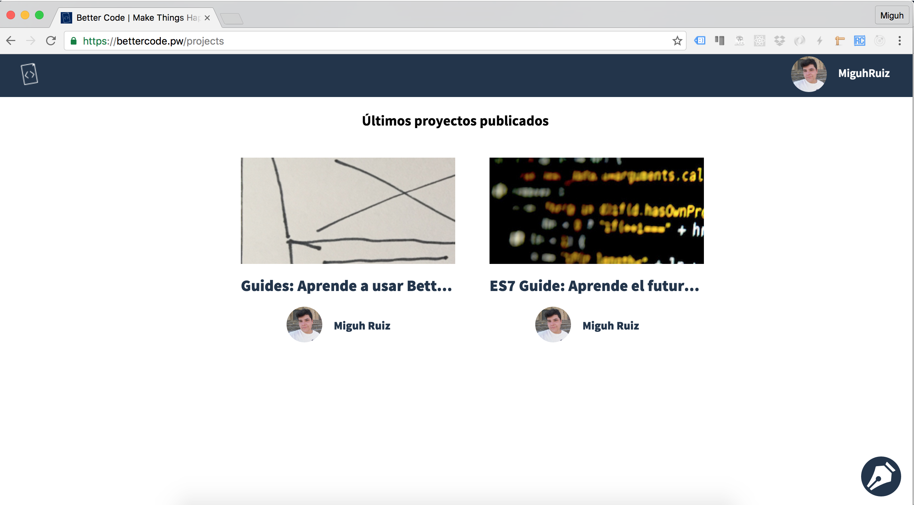
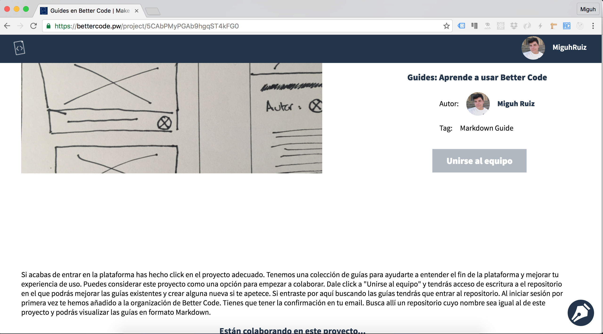
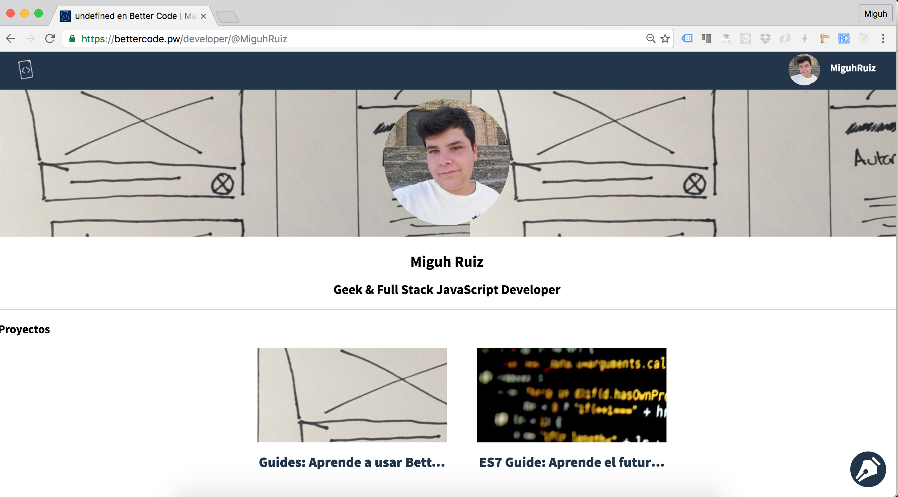

# A small tour by Better Code: Discover all sections of the application.

## Section project: The heart of the application.

Once you've logged into the application you will meet the project section. In this you can see all the ideas that people have created and access any of them, we will see in the next section.

---

## Project View: You're just one step to start working.

Once you've clicked on a project you will see details on this (title, label, description, collaborators ...) and **even the button magic** you become a partner:

---

## User view: Learn more about the community and see what they are doing.

During these earlier views, you will have seen that the application teaches you who created the project as well as a link to your profile (yours so you only have to click on your name in the top bar). In the profiles you can see more of them and know that ideas have created:

