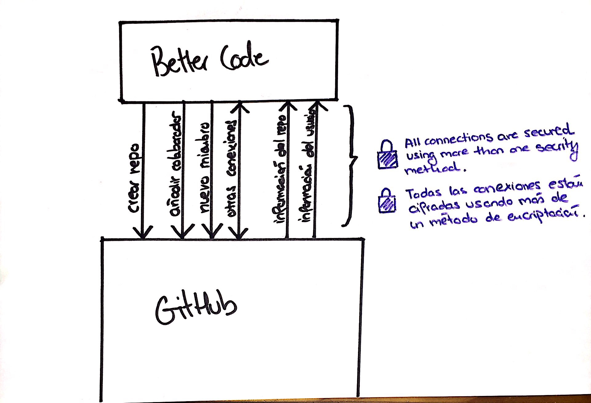

# How to Better Code works internally with GitHub

As you may have noticed when reviewing other Better Code and Github guides are very good friends and are constantly communicating. We wanted to dedicate this guide to tell you some of the things that are possible thanks to this friendship.

## Users: Profiles, Sessions, Internal Management ...

As you may have already noticed we use the OAuth Github, this allows us to Better Code developers a more friendly space. One of the most related to this visible in the application features is the instant invitation to the organization, which can start collaborating on ideas you want. **Not yet part of the organization Better Code on GitHub? Go check your email, there must be an invitation there!**

## Ideas: Repositories, Add Partners, Partners List ...

Everything you do on an idea in Better Code (or almost all) is connected to GitHub, for example when creating an idea repository is created to work ... This allows us to speed up the development of employees and focus all projects one place.

Those are the two main things we do with our friend GitHub, you have left a small sketch outline just where you can see the workflow between Github and Better Code.

